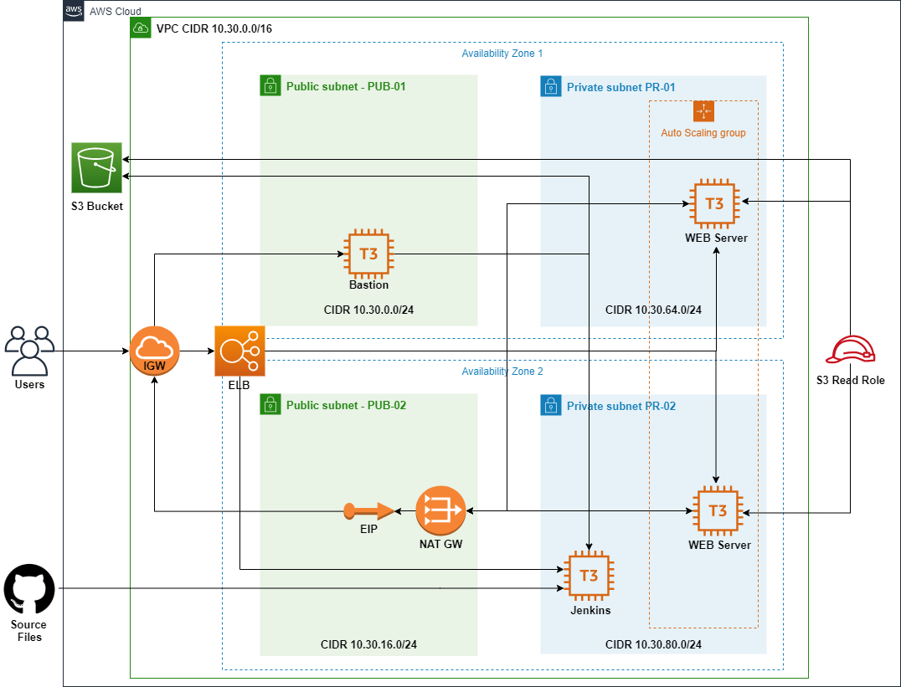

# Terraform
Deployment of infrustructure and application artifacts for a web site

# Requirements
* AWS account and a user with programmatic access and Admin rights _(required to create IAM roles)_
* Terraform <=0.12.6
* S3 bucket to host files for the upload to app servers _(can use a sample from a website_sample folder)_
* AWS key-pair(s) created in the target region
* All variables that require values are in the __terraform.tfvars__ file
* Jenkins configuration is out of scope for this project but it was tested with Blue Ocean and Pipeline: aws plugins 

# Architectural diagram
